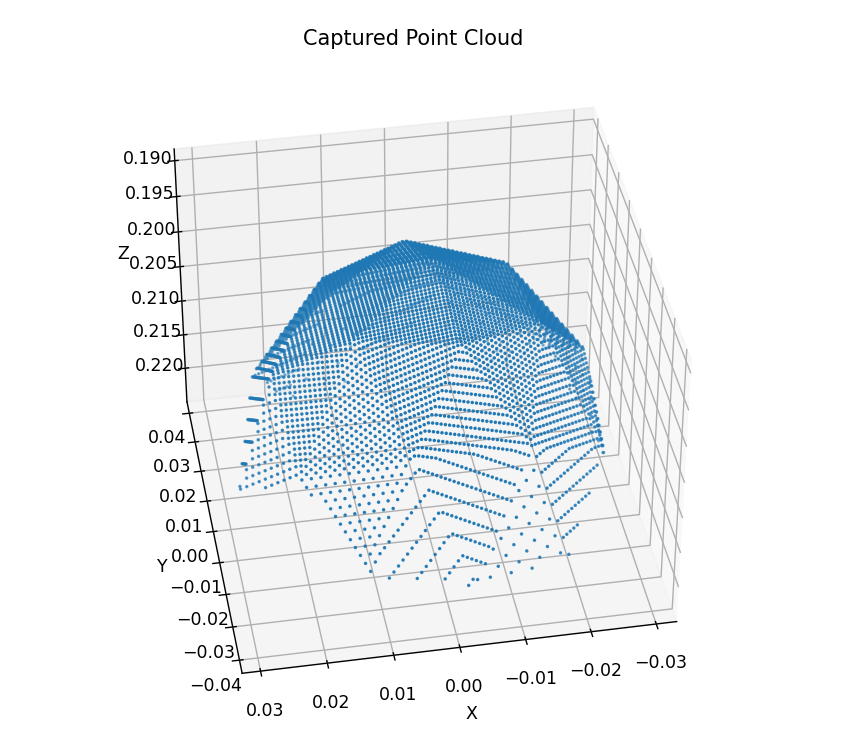
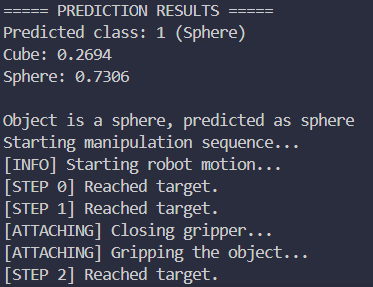
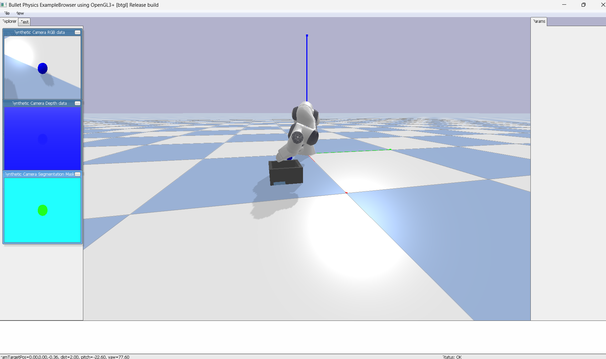

# PointNet Robotic Pick-and-Place

A Python-based robotic manipulation project that leverages PointNet model to classify 3D point clouds of objects (cube or sphere) and perform pick-and-place tasks using a Franka Panda robotic arm in a PyBullet simulation.

Inspired by the PointNet paper, this project demonstrates 3D object recognition and precise robotic motion control in a simulated environment.

---

> ⚡ **Note:** This is an upgraded version of a previously developed project.  
It now includes a more robust pipeline with:
- A pre-trained PointNet model for object classification
- A pick-and-place system integrated with PyBullet
- Dynamic object configuration (cube/sphere)
- High-accuracy model trained on a custom point cloud dataset
- Improved modularity and visualization tools

---

## 📸 Screenshots

Below are some snapshots from the simulation showcasing the robotic pick-and-place process:

|  |  |  |
|:-------------------------------------:|:-----------------------------------------------:|:------------------------------------------:|
| captured point cloud of the object | prediction  | Robot arm during pick-and-place |


## ✨ Features

- **Flexible Object Handling**: Seamlessly switch between a cube (5 cm) or sphere (2.5 cm radius) via a single configuration parameter.
- **Configurable Pick-up Logic**: Define whether to pick up cubes, spheres, or both based on actual and predicted object types.
- **Point Cloud Processing**: Capture and process point clouds using a simulated depth camera, with sampling and normalization for PointNet input.
- **Smooth Motion Control**: Execute collision-free pick-and-place with high-clearance trajectories to avoid tray walls.
- **Gripper Precision**: Robust gripper control with collision filtering for secure grasping of small objects.
- **Visualization**: Visualize point clouds using Matplotlib for debugging and analysis.
- **Custom Dataset**: Trained on point cloud data generated from the simulation for cubes and spheres.

---

## 📋 Prerequisites

- **Python**: 3.8 or higher  
- **Dependencies**:
  - `pybullet` (>=3.2.5): Physics simulation
  - `tensorflow` (>=2.8.0): PointNet model inference
  - `numpy` (>=1.21.0): Point cloud processing
  - `matplotlib` (>=3.5.0): Point cloud visualization

Install dependencies using pip:

```bash
pip install pybullet tensorflow numpy matplotlib
```

- **Hardware**: A GPU is recommended for faster TensorFlow inference, but CPU is sufficient.

---

## 📂 Project Structure

```
pointnet-robotic-pick-and-place/
├── checkpoints/
│   └── best_model.h5         # PointNet model
├── main.py     # Main script for simulation and manipulation
├── README.md                 # Project documentation
└── LICENSE                   # MIT License
```

---

## 🚀 Getting Started

### Clone the Repository

```bash
git clone https://github.com/Amannnrt/PointNet-RoboticManipulation.git
```
---
### Dataset Generation

The dataset was generated using a custom script `generation.py`, which runs the PyBullet simulation to create point cloud data for both **cubes** and **spheres**. The script captures depth images from a simulated camera, converts them into point clouds, and labels them accordingly.

To generate a new dataset, run:

```bash
python generation.py
```

The generated data can be used to retrain the PointNet model as described in the original paper.

---

### Configure the Simulation

Edit the configuration section in `main.py`:

```python
# Object Configuration
OBJECT_TYPE = "cube"  # Options: "cube" or "sphere"
SPHERE_RADIUS = 0.025
CUBE_HALF_EXTENTS = [0.025, 0.025, 0.025]
OBJECT_POSITION = [0.5, 0.0, 0.025]

# Pick-up Preferences
PICK_UP_CUBE = True
PICK_UP_SPHERE = True
```

- `OBJECT_TYPE`: Set to `"cube"` or `"sphere"` to spawn the desired object.
- `PICK_UP_CUBE` / `PICK_UP_SPHERE`: Set to `True` to pick up the object, `False` to skip.

### Run the Simulation

```bash
python main.py
```

The script will:
- Initialize a PyBullet simulation with the robot, object, and tray (with 0.1 m walls).
- Capture a point cloud of the object.
- Classify it using PointNet (`"Sphere"` or `"Other"`).
- Perform pick-and-place if allowed by preferences, moving the object to the tray at `[0.7, -0.3, 0.05]`.
- Display the point cloud and prediction results.

> Press **Q** to exit the simulation.

---

## 🛠️ Example Configurations

### Pick up a cube

```python
OBJECT_TYPE = "cube"
PICK_UP_CUBE = True
PICK_UP_SPHERE = False
```

### Pick up a sphere only if predicted as sphere

```python
OBJECT_TYPE = "sphere"
PICK_UP_CUBE = False
PICK_UP_SPHERE = True
```

### Skip manipulation for any object

```python
OBJECT_TYPE = "cube"
PICK_UP_CUBE = False
PICK_UP_SPHERE = False
```

---

## 🧠 Dataset and Model

The PointNet model (`best_model.h5`) was trained on a custom dataset of point clouds generated within this PyBullet simulation, featuring cubes and spheres. The model classifies objects as:

- **Sphere** (class `1`)
- **Other** (class `0`, includes cubes)

To train a new model, generate point cloud data from the simulation and follow the training procedure in the PointNet paper.

---

## 📊 Model Performance

The PointNet model was trained for approximately 50 epochs on simulation-generated point cloud data, starting from an initial accuracy of ~50%. The final performance metrics are:

| **Dataset**  | **Accuracy** | **Loss**  |
|--------------|--------------|-----------|
| Training     | 99.65%       | 0.0130    |
| Validation   | 99.67%       | 0.0634    |
| Test         | 99.90%       | 0.0427    |

- **Training Details**: Trained over 250 batches (~10 seconds per epoch), achieving near-perfect accuracy after ~50 epochs.
- **Test Set**: Evaluated on 62 batches, demonstrating robust generalization with 99.90% accuracy.
- **Observations**: The high accuracy reflects the model’s ability to reliably classify cubes and spheres, though performance may vary with noisy or misaligned point clouds.

---

## 📝 Technical Notes

- **Trajectory**: The arm uses a transit height of `0.15 m` to clear `0.1 m` tray walls, ensuring collision-free motion.
- **Gripper Control**: Precise control of gripper fingers (`open: 0.04 m`, `closed: 0.01 m`) with collision filtering for reliable grasping.
- **Limitations**: The model is trained only for cubes and spheres. New object types require retraining.

### Future Enhancements

- Support for additional object types
- GUI for real-time configuration
- Integration with real robotic systems

---

## 📜 License

This project is licensed under the **MIT License**.

---

## 🙌 Acknowledgments

- Inspired by **PointNet: Deep Learning on Point Sets for 3D Classification and Segmentation**
- Built with **PyBullet** and **TensorFlow**
